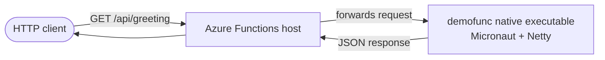

# native-image-for-functions

A sample project that compiles a [Micronaut](https://micronaut.io/) HTTP application into a
[GraalVM native image](https://www.graalvm.org/latest/reference-manual/native-image/) and runs it on
**Azure Functions** using a [custom handler](https://learn.microsoft.com/azure/azure-functions/functions-custom-handlers).

Because the application is shipped as a self-contained native executable, it starts in milliseconds and
keeps a small memory footprint — a good fit for the **Flex Consumption** plan where cold starts matter.

---

## Table of contents

- [How it works](#how-it-works)
- [Tech stack](#tech-stack)
- [Project layout](#project-layout)
- [The HTTP endpoint](#the-http-endpoint)
- [Prerequisites](#prerequisites)
- [Build](#build)
- [Run locally](#run-locally)
- [Package for Azure Functions](#package-for-azure-functions)
- [Deploy to Azure](#deploy-to-azure)
- [Configuration reference](#configuration-reference)
- [Testing](#testing)
- [Security](#security)
- [References](#references)

---

## How it works

Azure Functions custom handlers let you run any executable that exposes an HTTP server. The Functions host
forwards each incoming trigger to that executable. In this project the executable is a Micronaut + Netty server
built as a native image.



- The Functions host is configured with a `customHandler` whose `defaultExecutablePath` is `demofunc`.
- `enableProxyingHttpRequest` is `true`, so the original HTTP request is forwarded as-is to the Micronaut server.
- The Micronaut server listens on the port provided by `FUNCTIONS_CUSTOMHANDLER_PORT` and serves requests under the `/api` context path.

---

## Tech stack

| Area | Choice |
| --- | --- |
| Language | Java 25 |
| Framework | Micronaut Platform 5.0.x |
| HTTP runtime | Netty |
| Serialization | Micronaut Serialization (Jackson) |
| Native build | GraalVM `native-image` via `native-maven-plugin` |
| Build-time optimization | Micronaut AOT |
| Build tool | Maven |
| Hosting | Azure Functions (custom handler, Linux, Flex Consumption) |
| Tests | JUnit 5 + Micronaut Test |

Key versions are centralized as properties in [pom.xml](pom.xml) (for example `jdk.version`, `micronaut.version`,
`azure.functions.maven.plugin.version`).

---

## Project layout

```text
.
├── Dockerfile                       # linux/amd64 native build, zip export, local image, and Functions container
├── assembly.xml                     # maven-assembly descriptor (zips target/app)
├── compress.sh                      # Re-zips the package with no compression for deployment
├── aot-native-image.properties      # Micronaut AOT settings for native-image packaging
├── aot-jar.properties               # Micronaut AOT settings for jar packaging
├── pom.xml
├── src/
│   ├── main/
│   │   ├── java/dev/logicojp/micronaut/
│   │   │   ├── Application.java      # Micronaut entry point
│   │   │   ├── GreetingService.java  # @Controller exposing GET /greeting
│   │   │   └── Message.java          # @Serdeable response record
│   │   ├── function/                 # Azure Functions metadata
│   │   │   ├── host.json             # customHandler + extension bundle config
│   │   │   ├── local.settings.json   # FUNCTIONS_WORKER_RUNTIME=Custom
│   │   │   └── greeting/function.json# httpTrigger (anonymous GET) binding
│   │   └── resources/
│   │       ├── application.properties
│   │       └── logback.xml
│   └── test/java/dev/logicojp/micronaut/
│       ├── GreetingServiceTest.java
│       └── MessageTest.java
└── .github/workflows/
    ├── deploy-native-image.yml       # Build native image and deploy zip to Azure Functions Flex Consumption
    └── deploy-container-apps.yml     # Build/push Functions container and deploy to Azure Container Apps
```

---

## The HTTP endpoint

A single endpoint is exposed:

```
GET /api/greeting?name={name}
```

- `name` is optional and defaults to `world`.
- The response is JSON produced from the `Message` record.

Example:

```bash
curl "http://localhost:8080/api/greeting?name=Taro"
# {"message":"Hi, Taro, what's up?"}

curl "http://localhost:8080/api/greeting"
# {"message":"Hi, world, what's up?"}
```

The `/api` prefix comes from `micronaut.server.context-path` and lines up with the Azure Functions default route prefix.

---

## Prerequisites

| Tool | Notes |
| --- | --- |
| JDK 25 (GraalVM) | Required for JVM tests and direct Maven builds. |
| Maven 3.9+ | Required for JVM tests and direct Maven builds. |
| Docker | Required for the recommended linux/amd64 Azure Functions native package build. |
| Azure Functions Core Tools v4 | Optional — to run the package locally on a linux/amd64 host with `func`. |
| Azure CLI + subscription | For deploying to Azure. |

---

## Build

The Azure Functions deployment package must contain a Linux executable. Build the native image in a
`linux/amd64` environment; the recommended path is the Docker artifact target:

```bash
# Build the GraalVM native image and export target/app.zip
docker build --platform linux/amd64 --target artifact --output type=local,dest=target .

# Verify the deployment artifact
unzip -t target/app.zip
```

The Docker build runs Maven inside the official GraalVM musl image, executes the `native` profile, assembles
the Functions package, and exports `target/app.zip`.

The exported ZIP contains:

- `demofunc`, the linux/amd64 native executable.
- `host.json` and `local.settings.json`.
- `greeting/function.json`.

> The native image is built with `--no-fallback -Ob --static --libc=musl --gc=G1` (see the `native` profile in [pom.xml](pom.xml)).

### Run JVM tests

```bash
mvn -Dpackaging=jar test
```

### Build the Azure Functions container image

For Azure Functions on Azure Container Apps, build the `functions-runtime` target. This target uses the
Azure Functions custom-handler base image and copies the native executable plus Functions metadata into
`/home/site/wwwroot`.

```bash
docker build --platform linux/amd64 --target functions-runtime -t demofunc-functions .
```

The Dockerfile doesn't define its own `CMD` or `ENTRYPOINT` in this target. It intentionally inherits the
startup command from `mcr.microsoft.com/azure-functions/base:4`, which starts the Azure Functions host. The
host then reads `host.json` and launches `demofunc` through the `customHandler` configuration.

### Build the local native runtime image

For local smoke tests that don't need the Azure Functions host, build the `local-runtime` target. This runs the
Micronaut native executable directly.

```bash
docker build --platform linux/amd64 --target local-runtime -t demofunc-local .
```

### Direct Maven native build on Linux

If you are already on a compatible linux/amd64 host with GraalVM native-image and musl support, you can build
without Docker:

```bash
mvn -B -Pnative -DskipTests verify
./compress.sh
```

---

## Run locally

### Option A — run the local native runtime image

```bash
docker build --platform linux/amd64 --target local-runtime -t demofunc-local .
docker run --rm --platform linux/amd64 -p 8080:8080 demofunc-local
```

Then call:

```bash
curl "http://localhost:8080/api/greeting?name=Taro"
```

This option bypasses the Azure Functions host and is only a fast Micronaut/native-image smoke test.

### Option B — run through Azure Functions Core Tools on linux/amd64

Run `func` from the extracted package folder, which contains both the executable and `host.json`:

```bash
rm -rf target/app
mkdir -p target/app
unzip -q target/app.zip -d target/app
cd target/app
func start
```

On macOS, use the container option for local handler testing because the Azure deployment artifact is a Linux
native executable.

### Option C — run the Azure Functions container image

Use this when you want to test the Functions host and Custom Handler integration, not just the Micronaut server.
The Functions container listens on port `80`.

```bash
docker build --platform linux/amd64 --target functions-runtime -t demofunc-functions .
docker run --rm --platform linux/amd64 -p 8080:80 \
  -e AzureWebJobsStorage="<storage-connection-string>" \
  demofunc-functions
```

Then call:

```bash
curl "http://localhost:8080/api/greeting?name=Taro"
```

---

## Package for Azure Functions

Packaging is handled by Maven plus a small shell step inside the linux/amd64 build environment:

1. `maven-resources-plugin` copies `src/main/function/**` and the native executable into `target/app`.
2. `maven-assembly-plugin` (using [assembly.xml](assembly.xml)) zips `target/app` into `target/demofunc.zip`.
3. [compress.sh](compress.sh) extracts that archive, ensures `demofunc` is executable, and re-zips it
   **without compression** (`zip -0`) into `target/app.zip`. Storing the native binary uncompressed keeps it
   directly executable after extraction on the host.

The resulting `target/app.zip` is the artifact deployed to Azure Functions.

---

## Deploy to Azure Functions Flex Consumption

### Option A — GitHub Actions (recommended)

[.github/workflows/deploy-native-image.yml](.github/workflows/deploy-native-image.yml) builds the native image and
deploys it on every push to `main` (and via manual dispatch). It authenticates to Azure with OIDC federated
credentials, so no long-lived secrets are stored.

Configure these repository secrets:

| Secret | Purpose |
| --- | --- |
| `AZURE_CLIENT_ID` | App registration (federated credential) client ID |
| `AZURE_TENANT_ID` | Microsoft Entra tenant ID |
| `AZURE_SUBSCRIPTION_ID` | Target subscription |
| `AZURE_RESOURCE_GROUP` | Resource group containing the target Function App |
| `AZURE_FUNCTIONS_APP_NAME` | Target Function App name |

The workflow runs JVM tests, builds `target/app.zip` in a linux/amd64 Docker build, uploads it as an artifact,
configures the required custom-handler app settings, and deploys it with `azure/functions-action`.
For Flex Consumption apps, don't add `WEBSITE_RUN_FROM_PACKAGE`; zip deployment is still the recommended
deployment technology.

### Option B — azure-functions-maven-plugin

The `azure-functions-maven-plugin` is preconfigured in [pom.xml](pom.xml) (Linux, custom runtime, Flex Consumption).
Adjust the `functionAppName`, `resourceGroup`, and `region` properties, then:

```bash
az login
mvn -B -Pnative -DskipTests verify
./compress.sh
mvn azure-functions:deploy
```

### Option C — Azure Functions Core Tools

```bash
docker build --platform linux/amd64 --target artifact --output type=local,dest=target .
az functionapp deployment source config-zip \
  -g <resource-group> \
  -n <function-app-name> \
  --src target/app.zip
```

Once deployed, the endpoint is available at:

```
https://<function-app-name>.azurewebsites.net/api/greeting?name=Taro
```

---

## Deploy to Azure Functions on Azure Container Apps

Azure Functions on Azure Container Apps uses a containerized function app. Unlike the Flex Consumption flow,
the deployment artifact is a container image, not `target/app.zip`.

The [Dockerfile](Dockerfile) keeps both deployment flows:

- `artifact`: exports `target/app.zip` for Flex Consumption zip deployment.
- `local-runtime`: runs the Micronaut native executable directly for local smoke tests.
- `functions-runtime`: builds an Azure Functions custom-handler container based on
  `mcr.microsoft.com/azure-functions/base:4`.
  This target inherits the base image startup command so the Functions host starts first and then launches
  `demofunc` as the custom handler.

### GitHub Actions

[.github/workflows/deploy-container-apps.yml](.github/workflows/deploy-container-apps.yml) runs JVM tests and validates the
`functions-runtime` image build for `linux/amd64` on every push to `main`. A manual dispatch performs the Azure-authenticated
steps: pushing the image to Azure Container Registry, creating the Function App in the Container Apps environment when needed,
and updating the app to the pushed image.

Configure these repository secrets:

| Secret | Purpose |
| --- | --- |
| `AZURE_CLIENT_ID` | App registration (federated credential) client ID for GitHub OIDC |
| `AZURE_TENANT_ID` | Microsoft Entra tenant ID |
| `AZURE_SUBSCRIPTION_ID` | Target subscription |

Configure these repository variables:

| Variable | Purpose |
| --- | --- |
| `AZURE_RESOURCE_GROUP` | Resource group containing the Function App, ACR, storage, identity, and Container Apps environment |
| `AZURE_CONTAINERAPPS_FUNCTION_APP_NAME` | Function App name hosted on Azure Container Apps |
| `AZURE_CONTAINERAPPS_ENVIRONMENT` | Azure Container Apps environment name |
| `AZURE_STORAGE_ACCOUNT` | Storage account used by `AzureWebJobsStorage` |
| `AZURE_CONTAINER_REGISTRY` | ACR name, not the login server |
| `AZURE_CONTAINER_IMAGE_NAME` | Repository/name for the pushed Functions image |
| `AZURE_FUNCTIONS_MANAGED_IDENTITY_RESOURCE_ID` | User-assigned managed identity resource ID |
| `AZURE_FUNCTIONS_MANAGED_IDENTITY_CLIENT_ID` | User-assigned managed identity client ID |

The user-assigned managed identity should have:

- `AcrPull` on the Azure Container Registry.
- The storage data-plane roles needed by the Functions host for `AzureWebJobsStorage`; the Microsoft Learn
  Container Apps Functions guide uses `Storage Blob Data Owner`.

The workflow uses managed identity for both ACR pull and the `AzureWebJobsStorage__*` identity-based connection
settings. It doesn't use `azure/functions-action` because Container Apps hosting updates the container image
configuration instead of zip deploying a package.

### Manual image build and deployment outline

```bash
login_server=$(az acr show -n <acr-name> --query loginServer -o tsv)
image_uri="${login_server}/demofunc:<tag>"

az acr login -n <acr-name>
docker build --platform linux/amd64 --target functions-runtime -t "$image_uri" .
docker push "$image_uri"

az functionapp create \
  --name <function-app-name> \
  --resource-group <resource-group> \
  --storage-account <storage-account> \
  --environment <container-apps-environment> \
  --workload-profile-name "Consumption" \
  --functions-version 4 \
  --assign-identity <user-assigned-identity-resource-id>

az resource patch \
  --resource-group <resource-group> \
  --name <function-app-name> \
  --resource-type "Microsoft.Web/sites" \
  --properties "{\"siteConfig\":{\"linuxFxVersion\":\"DOCKER|${image_uri}\",\"acrUseManagedIdentityCreds\":true,\"acrUserManagedIdentityID\":\"<user-assigned-identity-resource-id>\"}}"

az functionapp config appsettings delete \
  --name <function-app-name> \
  --resource-group <resource-group> \
  --setting-names AzureWebJobsStorage

az functionapp config appsettings set \
  --name <function-app-name> \
  --resource-group <resource-group> \
  --settings \
    FUNCTIONS_WORKER_RUNTIME=Custom \
    FUNCTIONS_EXTENSION_VERSION=~4 \
    DOCKER_REGISTRY_SERVER_URL="https://<acr-name>.azurecr.io" \
    AzureWebJobsStorage__accountName=<storage-account> \
    AzureWebJobsStorage__credential=managedidentity \
    AzureWebJobsStorage__clientId=<user-assigned-identity-client-id>
```

Once deployed, the endpoint uses the Container Apps-hosted Functions URL:

```text
https://<function-app-name>.<generated-suffix>.<region>.azurecontainerapps.io/api/greeting?name=Taro
```

### Container Apps notes

- The Functions container listens on port `80` by default. `WEBSITES_PORT` is only needed if you change this.
- `FUNCTIONS_CUSTOMHANDLER_PORT` remains an internal port assigned by the Functions host to the custom handler;
  it isn't the public Container Apps ingress port.
- `local.settings.json` is removed from the Functions container image. Configure Azure settings through app settings.
- You must rebuild and republish the container image to pick up Functions base image security updates.

---

## Configuration reference

### `src/main/resources/application.properties`

| Property | Value | Notes |
| --- | --- | --- |
| `micronaut.application.name` | `demofunc` | Application name. |
| `micronaut.server.port` | `${FUNCTIONS_CUSTOMHANDLER_PORT:8080}` | Uses the port supplied by the Functions host; falls back to `8080` locally. |
| `micronaut.server.context-path` | `/api` | Matches the Azure Functions route prefix. |

### `src/main/function/host.json`

- `customHandler.description.defaultExecutablePath`: `demofunc`
- `customHandler.enableProxyingHttpRequest`: `true` (forwards the raw HTTP request to the handler on current hosts)
- `customHandler.enableForwardingHttpRequest`: `true` (kept for compatibility with Functions host images that still use the older setting name)
- `extensionBundle`: `[4.*, 5.0.0)`
- `functionTimeout`: `00:02:00`
- Dynamic concurrency is enabled.

### `Dockerfile`

- `artifact`: builds the native image and exports `target/app.zip` for Flex Consumption zip deployment.
- `local-runtime`: runs the native Micronaut executable directly for local smoke tests.
- `functions-runtime`: packages the native executable as an Azure Functions custom-handler container for Azure
  Container Apps hosting. It doesn't define `CMD` or `ENTRYPOINT`; those are inherited from the Azure Functions
  base image.

### `src/main/function/greeting/function.json`

- `httpTrigger`, `authLevel: anonymous`, method `GET`
- HTTP output binding

### Micronaut AOT

[aot-native-image.properties](aot-native-image.properties) and [aot-jar.properties](aot-jar.properties) drive
build-time optimizations (precomputed property sources, build-time service loading, GraalVM config generation, etc.).

---

## Testing

Tests use JUnit 5 and Micronaut Test (`GreetingServiceTest` exercises the endpoint via an injected HTTP client):

```bash
mvn -Dpackaging=jar test
```

> Use `-Dpackaging=jar` when running Maven goals that should not trigger the native-image packaging.

---

## Security

Dependency updates are managed by Dependabot ([.github/dependabot.yml](.github/dependabot.yml)) for Maven,
GitHub Actions, and Docker. The build also pins the Maven download in the [Dockerfile](Dockerfile) with a verified
SHA-512 checksum, and GitHub Actions are pinned to commit SHAs.

For how Dependabot alerts originating from build-time plugin transitive dependencies are triaged, see
[docs/security/dependabot-dismissal-policy.md](docs/security/dependabot-dismissal-policy.md).

---

## References

- [Micronaut User Guide](https://docs.micronaut.io/latest/guide/index.html)
- [Micronaut AOT documentation](https://micronaut-projects.github.io/micronaut-aot/latest/guide/)
- [Micronaut Serialization documentation](https://micronaut-projects.github.io/micronaut-serialization/latest/guide/)
- [Micronaut Maven Plugin documentation](https://micronaut-projects.github.io/micronaut-maven-plugin/latest/)
- [GraalVM Native Image](https://www.graalvm.org/latest/reference-manual/native-image/)
- [Azure Functions custom handlers](https://learn.microsoft.com/azure/azure-functions/functions-custom-handlers)
- [Azure Functions Flex Consumption plan](https://learn.microsoft.com/azure/azure-functions/flex-consumption-plan)
- [maven-enforcer-plugin](https://maven.apache.org/enforcer/maven-enforcer-plugin/)
